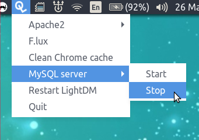

Unity Quick Launch Menu
=======================

The customizable quick launch menu you always wanted - for Ubuntu (using GTK3).





# Dependencies

- Python 2.x
- Yaml python package
- GTK3


# Configuration format

Use `_` (underscore) to mark shortkeys.

```yaml
menu_items:
  _Drush :
    command:
      - drush
      - "-r"
      - "/var/www"
      - cc
      - all
  Apache:
    menu_items:
      St_op:
        command:
          - service
          - apache2
          - stop
      St_art:
        command:
          - service
          - apache2
          - start
```


# Run

```bash
python quick_launch_menu.py
```
